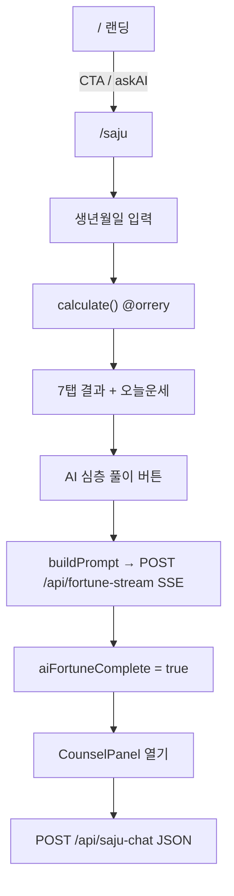

# saju-v2 전체 아키텍처 (2026-05-17)

> 홈페이지 Oracle 배포 전용 (`saju.coupax.co.kr`)  
> 토스 미니앱: `C:\커셔\토스 앱\사주팔자v1` (별도 repo)

---

## 1. 디렉터리 맵

```
saju-v2/
├── app/                    # Next.js App Router
│   ├── page.tsx            # / 랜딩 (→ HomePageClient)
│   ├── home-page-client.tsx
│   ├── saju/page.tsx       # /saju 메인 (~1780줄, client)
│   ├── saju/layout.tsx     # SEO metadata
│   ├── counsel/            # AI 심층 상담 (v3, 현재 사용 중)
│   ├── chat-widget.tsx     # 레거시 (~2640줄, 미사용)
│   ├── _legacy/            # chat-widget 백업
│   ├── site-chrome.tsx     # 네비·브랜드
│   ├── api/                # 12개 API 라우트
│   └── privacy, terms, rss, og, icon…
├── core/                   # 비즈니스 로직 (32 files)
│   ├── pillar-calc/        # 사주 계산
│   ├── daily-fortune/      # 오늘 운세·월별 브리프
│   ├── interpretation-db/  # 정적 해석 문자열
│   ├── ai-templates/       # AI 풀이 프롬프트
│   ├── api/consult-post.ts # 상담 LLM 공통
│   ├── config/llm.ts       # Groq→Gemini 파이프라인
│   ├── http-client/        # stream-fetcher, rate-limit
│   ├── counselor-config.ts
│   ├── kasi-api/           # KASI 클라이언트 (미연결)
│   └── data/               # 음력·절기 표 1900–2200
├── lib/support-account.ts  # 후원 계좌 env
├── public/                 # 정적 이미지, saju.html(레거시)
├── scripts/deploy-oracle.sh
└── docs/
```

---

## 2. 사용자 플로우



| 단계 | 코드 | API |
|------|------|-----|
| 사주 계산 | `core/pillar-calc/main-calculator.calculate` | — |
| 오늘 운세 | `core/daily-fortune.dailyFortune` | — |
| AI 심층 풀이 | `buildPrompt` + `fetchStream` | `POST /api/fortune-stream` |
| AI 상담 | `useCounselChat.send` | `POST /api/saju-chat` |
| TTS/STT | `use-tts`, `use-stt` | `/api/tts`, `/api/stt` |

---

## 3. core/pillar-calc (사주 엔진)

| 파일 | 역할 |
|------|------|
| `main-calculator.ts` | **진입점** `calculate(SajuInput)` → `SajuResult` |
| `korean-calendar-engine.ts` | 연·월·일·시 간지, 오행 상수 (`STEMS`, `STEM_ELEM`…) |
| `five-phase-breakdown.ts` | 오행 개수·최약 오행 |
| `celestial-relations.ts` | 신살 (도화·역마·화개·천을·문창) |
| `grand-fortune.ts` | `calcDaeun` (Next 앱 미사용, `public/saju.html`만) |

**외부 의존:** `@orrery/core/saju` (`calculateSaju`, `jasiMethod: 'split'`)  
**시주 미입력:** `hourTotalMin: -1` → 시주 `null`

**SajuResult:** `pillars[4]`, `ohaeng`, `daeun`, `shinsal`, `input`, `sipsin`, `unseong`, `jigang`

---

## 4. core/daily-fortune (일운)

```
index.ts (dailyFortune)
  ├── classifier.ts  — 신강/신약, 용신·희신·기신
  ├── scorer.ts      — 대운·세·월·일 점수 → 등급
  ├── events.ts      — 충·합·형 이벤트
  ├── constants.ts   — 상생상극, 용신표
  └── monthly-brief.ts — 12개월 브리프 (AI 프롬프트·UI 차트)
```

**소비자:** `saju/page.tsx` (`DailyFortuneCard`, `MonthlyChart`), `blueprints.ts`

---

## 5. core/interpretation-db

**단일 파일:** `matcher/index.ts` (인메모리 배열)

| 데이터 | 인덱스 | UI |
|--------|--------|-----|
| `IJ60_DESC` | 60갑자 | 일주 설명 |
| `KEYWORDS_BY_STEM` | 천간 0–9 | 성격 키워드 |
| `SCORES_BY_STEM` | 천간 | 재물·연애·건강·직업 점수 |
| `JOBS_BY_STEM` | 천간 | 직업 탭 |
| `F2026_BY_STEM` | 천간 | 2026 운세 |

---

## 6. core/ai-templates

| 파일 | export | 사용처 |
|------|--------|--------|
| `blueprints.ts` | `buildPrompt(SajuResult)` | `saju/page` → fortune-stream |
| `blueprints.ts` | `buildPremiumPrompt` | **미사용** |
| `character.ts` | `SYSTEM_PERSONA` | **미사용** |

`fortune-stream/route.ts`는 **별도 SYSTEM 프롬프트** 사용 (blueprints와 독립).

---

## 7. core/config/llm.ts (LLM 파이프라인)

```
fetchLlmStream(body)
  1. upstream stream:false 강제 (버퍼링)
  2. Groq llama-3.3-70b (GROQ_API_KEY_1~4 로테이션)
  3. 실패 시 Gemini 2.5 Flash
  4. auditAndRefineWithGemini (품질·PII·중복 검수)
  5. body.stream ? SSE 재생성 : JSON choices 반환
```

**max_tokens:** upstream 3000 클램프 (TPM 방지)  
**상담:** `consult-post` → `stream: false` → JSON `{ content }`

---

## 8. app/api 전체

| Route | 용도 | 핵심 import |
|-------|------|-------------|
| `fortune-stream` | AI 심층 풀이 SSE | `llm`, `rate-limit` (5/10min) |
| `saju-chat` | **상담 JSON** (단일) | `consult-post` |
| `saju-counsel` | 상담 alias | `consult-post` |
| `fortune-reply` | 상담 alias | `consult-post` |
| `chat` | 상담 (stream 기본 on) | `consult-post` |
| `consult` | chat re-export | `chat/route` |
| `tts` | Gemini TTS WAV | `counselor-config` |
| `stt` | Gemini STT | — |
| `gemma` | 레거시 JSON 분석 | `llm` |
| `kasi` | KASI 공공 API 프록시 | env |
| `feedback` | JSONL 피드백 | fs |
| `og` | 동적 OG 이미지 | `next/og` |

---

## 9. app/counsel (현재 상담 — v3)

| 파일 | 역할 |
|------|------|
| `CounselPanel.tsx` | UI: FAB, 패널, 말풍선, 입력, STT/TTS, Wake Lock |
| `use-counsel-chat.ts` | `msgsRef` 동기 관리, `POST /api/saju-chat` |
| `build-saju-context.ts` | `SajuResult` → 상담용 텍스트 |
| `use-tts.ts` | `/api/tts` 재생 |
| `use-stt.ts` | Web Speech API → 자동 send |

**핵심 버그 수정 (use-counsel-chat):**  
예전 `chat-widget`의 `snapshotForStream`은 React 배치 때문에 빈 배열 → API 미호출.  
→ `msgsRef`로 동기 읽기/쓰기.

**게이트:** `aiSummaryReady` (= `aiFortuneComplete`) false면 send 불가.

---

## 10. app/saju/page.tsx 구조

- **상태:** 입력폼, `result`, `fortuneResult`, `tab`(7종), `aiText`, `aiFortuneComplete`, 피드백
- **doAnalyze:** 음력→양력(`manseryeok`) → `calculate` → `dailyFortune`
- **askAI:** `fetchStream(buildPrompt)` → 완료 시 `setAiFortuneComplete(true)`
- **하위 컴포넌트 (같 파일):** `PillarGrid`, `OhaengCard`, `DailyFortuneCard`, `TabSung`…`TabHealth`, `AiRenderer`, `MonthlyChart`, `ZodiacBackground`
- **마운트:** `<CounselPanel result aiSummaryReady={aiFortuneComplete} />`

---

## 11. core/data (정적 만세력 데이터)

| 종류 | 파일 | 연결 |
|------|------|------|
| 절기 | `solar_terms_*.ts` → `solar-terms-local` | `korean-calendar-engine` |
| 음력 | `lunar_table_*.ts` → `lunar-local` | **앱 미사용** (클라는 `manseryeok`) |

---

## 12. 환경 변수

| 변수 | 용도 |
|------|------|
| `GROQ_API_KEY` / `_1`~`_4` | 1차 LLM |
| `GOOGLE_AI_API_KEY` | Gemini 폴백·감시·STT·TTS |
| `ANTHROPIC_API_KEY` | LLM_CONFIG만 (기본 경로 미사용) |
| `KASI_SERVICE_KEY` | `/api/kasi` |
| `NEXT_PUBLIC_API_BASE` | 클라이언트 API prefix |
| `NEXT_PUBLIC_GA_ID` | Analytics |
| `NEXT_PUBLIC_SUPPORT_*` | 후원 계좌 UI |

---

## 13. 배포

- Oracle VM `ubuntu@168.107.31.153`
- `/home/ubuntu/saju-v2`, PM2 `saju-v2`, port **3001**
- `bash scripts/deploy-oracle.sh` (stop → rm .next → build → start)

---

## 14. 레거시·미사용

| 항목 | 상태 |
|------|------|
| `app/chat-widget.tsx` | **미import** — 삭제 후보 |
| `app/_legacy/chat-widget.tsx.bak` | 백업 |
| `buildPremiumPrompt`, `SYSTEM_PERSONA` | 코드만 존재 |
| `core/kasi-api/client.ts` | 라우트가 인라인 구현 |
| `core/data/lunar-local` | Next 페이지 미연결 |
| `grand-fortune.calcDaeun` | orrery 대운 사용 |
| `public/saju.html` | 정적 레거시 페이지 |

---

## 15. 의존성 그래프 (요약)

```
@orrery/core ──► main-calculator ──► saju/page
                      │
        ┌─────────────┼─────────────┐
        ▼             ▼             ▼
  daily-fortune  interpretation-db  blueprints
        │                           │
        └──────────► buildPrompt ───┼──► fortune-stream ──► llm
                                    │
CounselPanel ──► use-counsel-chat ──┴──► saju-chat ──► consult-post ──► llm
              └──► tts / stt
```

---

*상담 재구축 Phase 계획은 `SAJU-ARCHITECTURE-AND-COUNSEL-PLAN.md` 참고.  
Counsel v3는 Phase 2 상당 부분이 이미 반영된 상태.*
